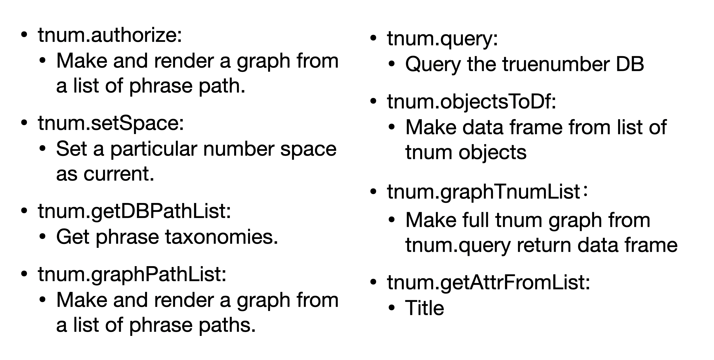

```{r setup, include=FALSE, echo=FALSE, message=FALSE, warning=FALSE}
library(png)
library(jpeg)
library(grid)
library(knitr)
library(kableExtra)
library(tidyverse)
library(revealjs)
```


<section data-background-image="images/new-mexico-banner-6b5ab7d2.jpeg";
<section data-background-image="images/new-mexico-banner-title-slide.png";
         data-background-size:"contain"
         background-repeat: no-repeat;>
<title>

</title>

</section>


# The MSSP NCNM Team {data-background="images/bkgnd-1.svg"}


The MSSP NCNM Presentation
- Professor: Haviland Wright

- Group 1: Jimmy Ye, Jinyu Li, Yuli Jin

- Group 2: Daniel Xu, Kayla Choi, Nancy Shen

- Group 3: Mi Zhang, Boyu Chen, Shicong Wang, Biyao Zhang

- Group 4: Keliang Xu, Yingjie Wang, James He, Ruining Jia


# Our Partners {data-background="images/bkgnd-2.svg"}

- Alison Turner: A Community Development Planner at NCNMEDD and recent MSSP graduate

- Aidan O'Hara: Working with Alison since late July

- Allen Razdow: Founder and president of True Engineering Technology, LLC and originator of Truenumbers


# Project Background {data-background="images/bkgnd-2.svg"}

<div style="font-size:14pt">

- The current developing situation in NCNM:

Historically, few resources to acquire grants <br>
Trouble successfully administering grants to complete projects <br>
Currently, at a turning point: <br>
New pandemic-related dollars flowing to the region; have capital to spend on new projects<br>
Two big issues of broadband access and issues of outmigration <br>

- What approaches are used for collecting data:

Census; they don’t collect a lot of data from their office<br>
They would like recommendations on the gaps in census data or the insufficiencies that they’re seeing by the census as a region.

- What variables will we use for this project? On what scales are they measured:

Demographics(categorical).<br>
Income(numerical), range: 0-1,000,000,000,000 (unsure if this is the maximum) gross receipts tased.<br>
Unemployment rate(numerical).<br>
GDP(numerical).<br>
Number of business establishments(numerical).<br>

</div>

# Project focus {data-background="images/bkgnd-2.svg"}

<div style="font-size:16pt">

The ED-900 form must accompany all EDA grant applications.  Here's an example:   
<div style="left-margin:40px">
 - [ED-900 form]https://tahoeprosperity.org/wp-content/uploads/TPC-EDA-finalgrant-form-900.pdf)
<br><br>

Ultimate Goal:

- TrueNumbers database that can be accessed by NCNMEDD and local government staff to assist with grant applications.

- An analysis of the data from the region - we have fairly low census response rates which could lead to data quality issues 

- If data quality issues exist, come up with supplemental sources of data to improve inferences made about the region.

Focusing on for this semester:

- TrueNumbers

- Dive into what the census is, why it’s important, and how low response rates may pose an issue.

</div>
</div>

# Our approach {data-background="images/bkgnd-2.svg"}

- Streamline the data acquisition, organization, and analysis process.

- Using Tnum package, created function to extract county-level census data.

- Visualization using ggplot to check the relationship between variables.

- Create some models to have an in-depth insight of the grant situation of New Mexico

# Truenumbers {data-background="images/bkgnd-2.svg"}



# Truenumbers continue.. {data-background="images/bkgnd-2.svg"}


# Truenumbers continue... {data-background="images/bkgnd-2.svg"}


# Data {data-background="images/bkgnd-2.svg"}

<div style="font-size:16pt">
Data Source
<div style="left-margin:40px">
Our data is from ACS(American Community Survey). 

The ACS is a large demographic survey collected throughout the year using mailed questionnaires, telephone interviews, and visits from Census Bureau field representatives to about 3.5 million household addresses annually.

Data availability for geographic areas differs by population size: 
<div style="font-size:15pt">
1-year estimates are available for areas of population 65,000 or more, while 5-year estimates are available for all areas.
</div>
</div>
</div>

# Data {data-background="images/bkgnd-2.svg"}

<div style="font-size:16pt">
<b>Parameter interpretation</b>
<div style="left-margin:40px">
Estimates are produced for 
- demographic characteristics (sex,age,);<br>
- social characteristics (school enrollment, educational attainment);<br>
- economic characteristics (employment status, commuting to work);<br>
- housing characteristics (housing occupancy, units in structure).<br>

In this presentation, we basically focused on<br>


</div>
</div>

# Data {data-background="images/bkgnd-2.svg"}

<div style="font-size:16pt">
<b>What did we do?</b>
<div style="font-size:14pt">
Design functions to clean the data in order to let everyone easily use 'filter&select' to tackle the data:
<div style="left-margin:40px">
Modify Dataset:
- clean_tag: Modify the columns of subjects and tags to more simple columns <br>
- get_county: Modify the column of county to more simple column <br>

Function for tackling the data for further analysis:
- get_county_data: This function is designed to get the data from different county <br>
 
You still need some steps to get the data: 
Connect BU VPN: vpn.bu.edu <br>
Run the following code and wait for seconds: <br>
- source(file='data_clean/mexico_screen_function.R')<br>
- data<-get_county_data()<br>
- data %>% view()<br>
</div>
</div>
</div>
 
# EDA Appetizer {data-background="images/bkgnd-2.svg"}


<div style="left-margin:40px">
This images shows the overall population of New Mexico as well as the eight counties that we are interested in.
</div>

# EDA Appetizer {data-background="images/bkgnd-2.svg"}


<div style="left-margin:40px">
This is a plot shows the percentages of the observations of eight counties in our data. We can see that Santa Fe and Sandoval are the two major counties where census collected more data.
</div>

# EDA Appetizer {data-background="images/bkgnd-2.svg"}


<div style="left-margin:40px">
By comparing the races of eight counties which shows the dominant race is white in all of them. In addition, both Sandoval and Santa Fe have larger population then rest of them.
</div>

# EDA Appetizer {data-background="images/bkgnd-2.svg"}


<div style="left-margin:40px">
The figure can clearly reflect the difference in per capita income between different counties, as well as the change in per capita income in the same county every year.
</div>

# Conclusion {data-background="images/bkgnd-2.svg"}
<div style="fond-size:16pct">
<b>What we have done for now:</b>
<div style="fond-size:15pct">
- Tnum part:
<div style="fond-size:14pct">
1. Summarize and understand the Tnum functions; <br>
2. Familiar with Tnum cheatsheet and making tree graphs<br>

<div style="fond-size:15pct">
- Data part: 
<div style="fond-size:14pct">
1. Extract 43796 raw observations;<br>
2. Have Designed two function to split the two columns contain txt into seven columns;<br>
3. Extract some useful information like time, county, etc for EDA team.<br>

<div style="fond-size:15pct">
- EDA:
<div style="fond-size:14pct">
1. The majority of census data collected from Sandoval and Santa Fe;<br>
2. The dominant race in these eight counties is white;<br>
3. But we also found that the gap between the poor and the rich is very large. The relationship between population and per capita income is Inversely Proportional.<br>

</div>
</div>
</div>
</div>
</div>
</div>
</div>

# What we are going to do next: {data-background="images/bkgnd-2.svg"}

1. Come up with mapping, text, graphs routine so that the we can easily re-create new pictures in the future.<br>
2. Set a standard for future presentation slides.<br>
3. From the present basic analysis to more detailed geolocated maps and graphs, including bar charts, pie chart, etc.<br>
4. Further analyze the data we have, and try to get more numeric values.<br>
5. Design a Tnum database and paper describing any findings on data quality to help set up a standard to apply for grant.<br>


# Questions {data-background="images/bkgnd-2.svg"}


# Thank you {data-background="images/bkgnd-2.svg"}

